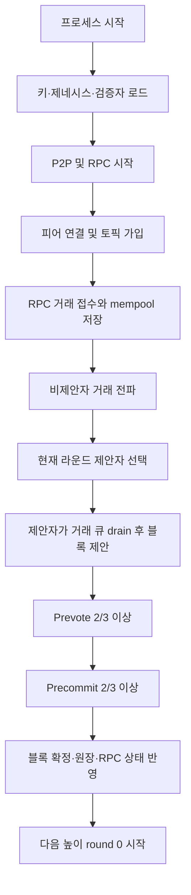
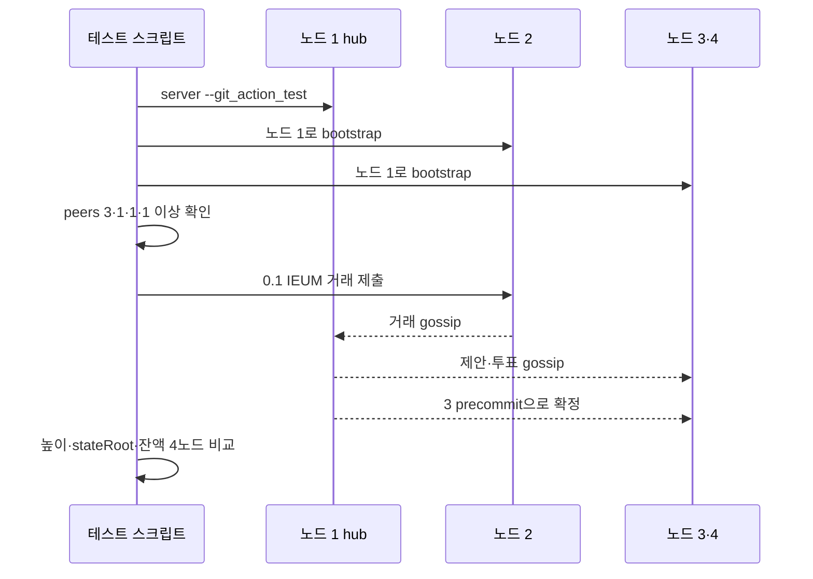

# IEUM 합의·블록 생성 흐름과 장애 확인 가이드

이 문서는 노드 시작부터 거래 확정까지의 정상 흐름, 관련 코드와 로그, 실패 지점을 한눈에 대조하기 위한 운영·개발 공통 안내서다.

## 1. 전체 흐름



거래 해시가 반환된 시점은 `E`까지만 성공한 것이다. 테스트 성공은 네 노드 모두 `K`까지 완료해 높이, 상태 루트, 수신 잔액이 같아야 한다.

## 2. 단계별 코드와 정상 로그

| 단계 | 주요 코드 | 정상 확인 로그·RPC | 실패 의미 |
|---|---|---|---|
| 초기 파일 준비 | `installation::prepare_server_files` | `[초기 설정 완료]`, `[개발망 자동 생성]` | 키 또는 설정 파일 생성·읽기 실패 |
| P2P 시작 | `P2pNode::run` | `QUIC P2P 대기`, `[P2P 연결]` | 포트, PeerId, bootstrap 주소 문제 |
| RPC 시작 | `RpcServer::run` | `geth 호환 JSON-RPC 대기` | RPC 포트 충돌 또는 초기 원장 오류 |
| 검증자 준비 | `load_validators`, `ConsensusRuntime::with_signer` | `[합의 참여]` | 로컬 키가 검증자 집합과 불일치 |
| 거래 접수 | `eth_sendTransaction`, `Mempool::add` | 송금 해시 반환, `txpool_status.pending > 0` | 서명, 잔액, nonce 또는 RPC 입력 오류 |
| 거래 전파 | `PublishTransaction`, `TransactionReceived` | `[P2P 거래 수신]` | 피어 또는 GossipSub 토픽이 아직 준비되지 않음 |
| 제안 | `can_make_proposal`, `make_proposal` | `[P2P 제안 수신]` | 제안자 불일치, 라운드 차이, 거래 검증 실패 |
| 투표 | `receive_vote` | prevote/precommit 진행 | 제안보다 투표가 먼저 오면 잠시 보류 가능 |
| 확정 | `finalize_if_ready`, `install_finalized` | `[BFT 확정] 높이 N ... precommit 3개` | 2/3 precommit 미달 또는 노드별 상태 불일치 |
| 테스트 완료 | `tests/four_process_network.sh` | `4-process BFT passed` | 네 노드 중 하나라도 높이·상태·잔액 불일치 |

## 3. 거래 큐의 안전 규칙

1. `consensus.can_make_proposal()`이 참인 현재 제안자만 `drain_transactions()`를 호출한다.
2. 비제안자는 거래를 큐에서 제거하지 않고 snapshot만 P2P로 알린다.
3. 같은 거래는 2초 이내 반복 전파하지 않아 합의 메시지를 방해하는 폭주를 막는다.
4. 확정 블록을 RPC 상태에 설치하면 이미 처리된 nonce의 거래는 mempool에서 제거한다.
5. 제안 도중 라운드가 바뀌거나 제안이 실패하면 꺼낸 거래를 큐에 복원한다.

## 4. GitHub Actions 4프로세스 테스트 순서



RPC 준비만으로 P2P 준비를 판단하면 안 된다. 스크립트는 이제 노드 1에 피어 3개, 나머지 노드에 각각 피어 1개가 연결된 뒤 거래를 제출한다.

## 5. 이번 실패 로그의 위치

관찰된 흐름은 다음과 같다.

```text
RPC 준비 및 faucet 확인 성공
→ 노드 2가 거래 접수, 해시 반환
→ 일부 노드가 P2P mesh 완성 전에 합의 round 시작
→ 노드 1에서는 높이 1이 precommit 3개로 확정
→ 다른 노드는 이전 높이/라운드 투표를 거부하거나 확정 상태 반영이 늦음
→ 네 RPC의 높이·stateRoot·잔액이 제한 시간 안에 일치하지 않아 실패
```

`[BFT 확정]` 한 줄은 해당 노드 하나의 확정을 뜻한다. 전체 테스트 성공을 뜻하지 않는다. `nonce 오류: 기대 1, 입력 0`은 이미 높이 1을 적용한 노드가 늦게 도착한 nonce 0 제안 또는 거래를 다시 검사했다는 신호다.

`P2P 이벤트 처리 오류: 해석할 수 없는 메시지입니다.`는 JSON으로 해석할 수 없는 GossipSub payload를 받았다는 뜻이며 정상 로그가 아니다. 재발 시 오류 로그에 토픽, payload 크기, 발신 PeerId를 추가해 어떤 메시지 종류가 섞였는지 별도로 추적해야 한다.

## 6. 빠른 판정 체크리스트

- 송금 해시만 출력됨: RPC 접수 성공, 합의 성공 아님
- `[P2P 연결]`이 부족함: 거래 제출 전 네트워크 준비 실패
- `[BFT 투표 보류]`가 잠깐 출력됨: 비동기 도착으로 가능, 지속되면 제안 전파 확인
- `현재 높이/라운드와 다른 투표`: 노드별 round 진행 시점이 갈림
- `nonce 오류: 기대 1, 입력 0`: 확정 뒤 늦은 중복 거래·제안 수신
- `[BFT 확정] ... precommit 3개`: 해당 노드의 BFT 확정 성공
- `4-process BFT passed`: 네 노드 상태 일치까지 포함한 최종 성공

## 7. 운영과 CI의 경계

`--git_action_test`는 루프백 P2P, 고정 개발 검증자 키, CI 전용 초기 잔액만 활성화한다. 일반 `server` 실행의 운영 bootstrap, 외부 주소 학습, 키와 제네시스는 이 옵션의 영향을 받지 않아야 한다. 테스트를 통과시키기 위해 운영 합의 규칙이나 검증 기준을 완화해서는 안 된다.
